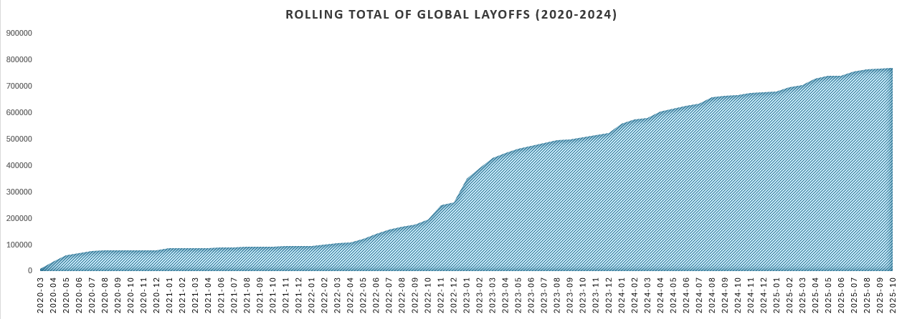
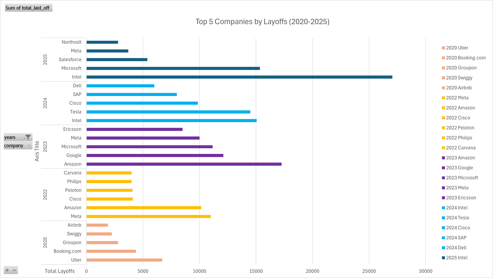

# Global Layoffs — Data Cleaning & Exploration (MySQL)

This project focuses on **data cleaning, transformation, and exploratory data analysis (EDA)** using MYSQL, utilising a real dataset from [Kaggle’s Global Layoffs Dataset](https://www.kaggle.com/datasets/swaptr/layoffs-2022).  
The goal is to simulate a real-world data analyst workflow by cleaning messy data, creating reusable staging tables, standardizing fields, and extracting insights using SQL queries that can be used to aid in strategic business decisions.

---

## Project Overview

| Category | Details |
|-----------|----------|
| **Data Source** | [Kaggle – Layoffs Dataset](https://www.kaggle.com/datasets/swaptr/layoffs-2022) |
| **Database** | MySQL 8 |
| **Skills Practiced** | Data cleaning, standardization, following workplace best practices, date formatting, exploratory SQL, window functions |
| **Focus Areas** | Company layoffs by month and year, total layoffs over time, top affected companies per year |

---

## Objectives

1. **Clean the raw dataset**
   - Remove duplicates  
   - Standardize inconsistent formatting  
   - Handle null or blank values  
   - Format dates properly  

2. **Perform exploratory SQL analysis**
   - Track layoffs over time (monthly and cumulative totals)  
   - Identify top companies by number of layoffs each year  
   - Investigate any potential patterns  

3. **Create basic visualization of trends**
---

## Key Insights 

### Layoff Trends Over Time
Layoffs increased sharply throughout 2022, peaking in early 2023.


### Top Companies by Layoffs 
The top 5 companies (e.g., Intel, Microsoft, and Amazon) accounted for a large share of total layoffs.



## Tools Used

- **MySQL Workbench** — SQL execution and schema design  
- **Kaggle** — dataset source and documentation  
- **Excel / CSV viewer** — for data inspection  
- **GitHub** — portfolio hosting  

---

## Database Creation and Setup
```sql
CREATE DATABASE world_layoffs;
USE world_layoffs;
```

Imported the .csv dataset into MySQL via the data import wizard feature. 
